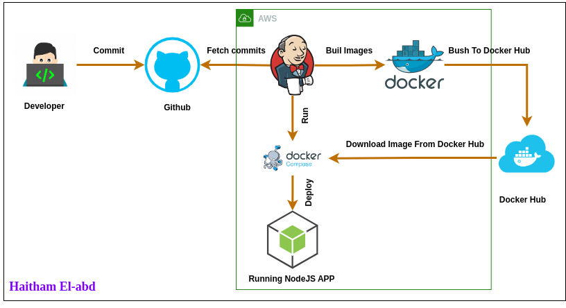

## Node.js CI/CD Pipeline with Jenkins

This project demonstrates a basic Continuous Integration/Continuous Deployment (CI/CD) pipeline using Jenkins to deploy a simple Node.js application. The pipeline is designed to fetch code from a GitHub repository, build a Docker image, push it to Docker Hub, and deploy the application using Docker Compose on an AWS instance.

### Prerequisites

To replicate this CI/CD pipeline, ensure you have the following prerequisites set up:

1. Jenkins: Installed and running on an AWS instance or on any cloud Provider.
2. Docker and Docker Compose: Installed on the same instance. 

### Jenkins Pipeline Overview

The Jenkins pipeline is defined in a `Jenkinsfile` and consists of the following stages:

1. **Code**: Clones the Node.js application repository from GitHub.
2. **Build and Test**: Builds a Docker image for the Node.js application.
3. **Login**: Authenticates Docker to Docker Hub using credentials stored in Jenkins.
4. **Push**: Pushes the Docker image to Docker Hub.
5. **Deploy**: Deploys the application using Docker Compose.

**<u>Make sure</u>** to replace the placeholder values (e.g., credentials, GitHub  repository URL, etc.) with your actual credentials and repository  information in the Jenkinsfile.

### Docker and Docker Compose Files

This project includes Docker and Docker Compose configuration files to containerize and deploy the Node.js application. Make sure to review and customize these files based on your application's specific requirements.

- **Dockerfile**: Contains instructions to build the Docker image.
- **docker-compose.yml**: Defines services, networks, and configurations required to run the application using Docker Compose.
